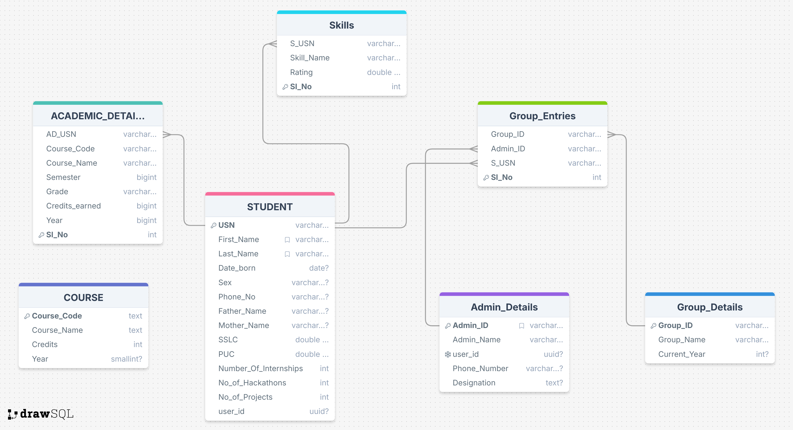

# Student Progress Tracker

A concise student performance tracking and placement prediction system built with React, Flutter, and FastAPI. The project helps institutions monitor student progress, analyze academic performance, and predict placement outcomes using machine learning.

## Overview

Student Progress Tracker is a full-stack application designed to help faculty track student performance and provide students with data-driven insights about their academic progress. The system integrates machine learning models to predict placement probability based on academic records and provides personalized recommendations for improvement.

## Features

### For Students

- **Academic Performance Dashboard**: View semester-wise course progress and marks
- **Placement Prediction**: ML-powered predictions for placement probability based on academic performance
- **Career Recommendations**: Personalized career suggestions and guidance
- **Progress Analytics**: Visual representation of academic trends and achievements
- **CO Marks Tracking**: Track Course Outcome marks for continuous assessment

### For Faculty

- **Teacher Portal**: Comprehensive view of student performance across semesters
- **Bulk Data Upload**: Upload and manage academic records efficiently
- **Student Performance Analysis**: Track individual and cohort performance metrics
- **Academic Record Management**: Add and update student academic information

### Technical Features

- **Multi-platform Support**: Web application (React) and mobile application (Flutter)
- **RESTful API**: FastAPI backend with high-performance endpoints
- **Real-time Data**: Supabase integration for real-time database operations
- **Machine Learning Integration**: Random Forest model for placement prediction
- **Scalable Architecture**: Support for both SQL (Supabase) and NoSQL (MongoDB) databases

## Technology Stack

### Frontend

- **React Web App**: Built with Vite, Material-UI, TailwindCSS
- **Flutter Mobile App**: Cross-platform mobile application for Android and iOS
- **Routing**: React Router for navigation
- **Data Visualization**: Recharts for analytics and graphs
- **State Management**: React hooks and context API

### Backend

- **FastAPI**: High-performance Python web framework powering the API
- **Databases**: Primary storage with Supabase (PostgreSQL). The FastAPI backend also supports NoSQL storage via MongoDB (using Motor) for flexible document models and use-cases requiring schemaless data.
- **Machine Learning**: scikit-learn, pandas, numpy for placement prediction

### Machine Learning

- **Algorithm**: Random Forest Classifier
- **Dataset**: 10k+ placement records for training
- **Features**: Academic performance metrics, CO marks, semester-wise scores
- **Output**: Placement probability score with confidence level and recommendations

### Database

- **Supabase (PostgreSQL)**: Primary database for structured data
- **MongoDB**: Optional NoSQL database for flexible data storage
- **Schema**: Normalized database design with proper relationships

## Project Structure

```
├── api/                          # FastAPI backend
│   ├── app.py                   # Main API application
│   ├── database/                # Database clients (Supabase + optional Mongo)
│   │   └── supabase_client.py  # Supabase connection handler
│   ├── ml/                      # Machine learning modules
│   │   └── predictor.py        # Placement prediction model
│   └── utils/                   # Utility functions
│       └── recommendations.py  # Recommendation generator

├── frontend/                    # React web application
│   ├── src/
│   │   ├── components/         # Reusable UI components
│   │   ├── pages/              # Main application pages
│   │   └── routes/             # Routing configuration
│   └── package.json

├── student_progress_app/        # Flutter mobile application
│   ├── lib/
│   │   ├── main.dart          # App entry point
│   │   ├── routes/            # Navigation routes
│   │   └── widgets/           # Reusable widgets
│   └── pubspec.yaml

├── data/                        # Training datasets
│   ├── placementdata - 10k.csv
│   └── student career suggestion - 20k.csv

├── models/                      # Trained ML models
│   ├── RF_final.pkl           # Random Forest model
│   └── cleaning.ipynb         # Data preprocessing notebook

```

## API Endpoints

### Health Check

```
GET /health
```

Returns system status, model loading state, and database connectivity.

### Placement Prediction

```
GET /predict/{usn}
```

Predicts placement probability for a student by USN (University Seat Number).

**Response includes:**

- Placement score (0-100)
- Prediction result (Placed/Not Placed)
- Confidence level
- Feature analysis
- Personalized recommendations

### API Routes

- **GET /**: Root endpoint; returns basic API metadata and available endpoints (including `/docs`).
- **GET /health**: Health check — returns service status, whether the ML model is loaded, and database connectivity.
- **GET /predict/{usn}**: Placement prediction for the given student USN. Returns placement score, prediction, confidence, features, and recommendation.
- **GET /docs**: Interactive API docs (Swagger UI) served by FastAPI.
- **GET /openapi.json**: OpenAPI spec for the API.

CO marks (NoSQL / MongoDB-backed) endpoints:

- **POST /api/co-marks/save**: Save or update CO marks for a student. Expects a JSON body with `student_usn`, `group_id`, `course_code`, `exam_type`, and `co_data`.
- **GET /api/co-marks/{student_usn}/{group_id}**: Retrieve CO marks for a specific student inside a group.
- **GET /api/co-marks/group/{group_id}**: Retrieve all CO marks documents for a specific group.

## Database Schema

The application uses a normalized relational database with the following key entities:

- **Students**: Student profile and authentication
- **Academic Records**: Semester-wise marks and performance
- **Courses**: Course information and metadata
- **CO Marks**: Course Outcome continuous assessment
- **Placements**: Placement records and outcomes

<p align="center"></p>

## Machine Learning Model

The placement prediction system uses a **Random Forest Classifier** trained on historical placement data:

- **Training Data**: 10,000+ student placement records
- **Features**: Academic scores, semester marks, CO marks, attendance, projects
- **Accuracy**: High prediction accuracy with confidence scoring
- **Output**: Binary classification (Placed/Not Placed) with probability score

### Prediction Process

1. Fetch student academic data from database
2. Preprocess and normalize features
3. Apply trained Random Forest model
4. Generate placement probability score
5. Provide personalized recommendations based on weak areas

<!-- Development checklist, Contributing, and License sections removed as requested -->
